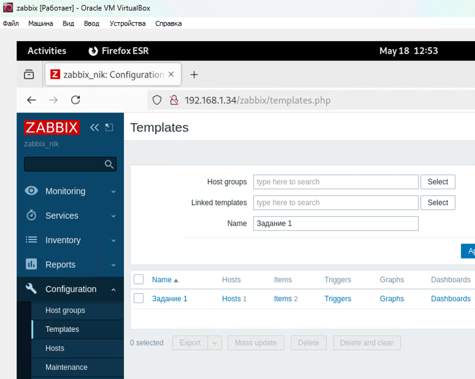
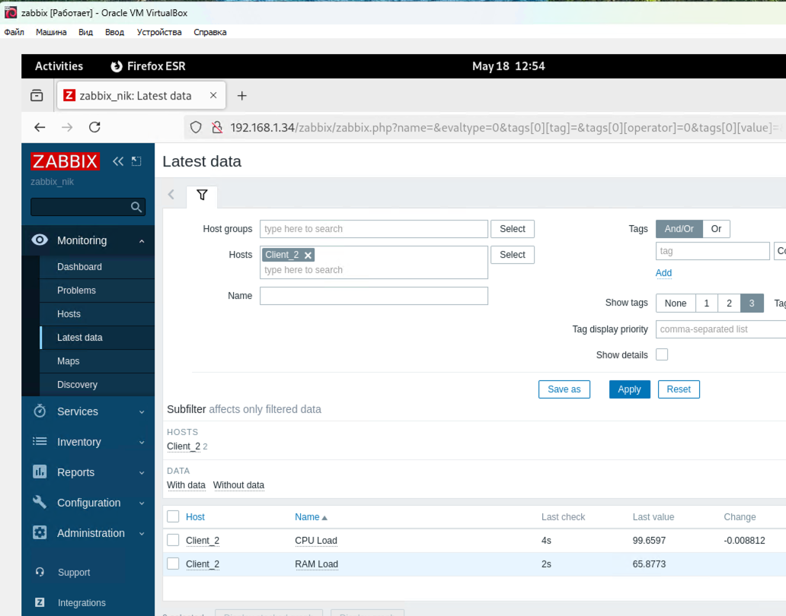
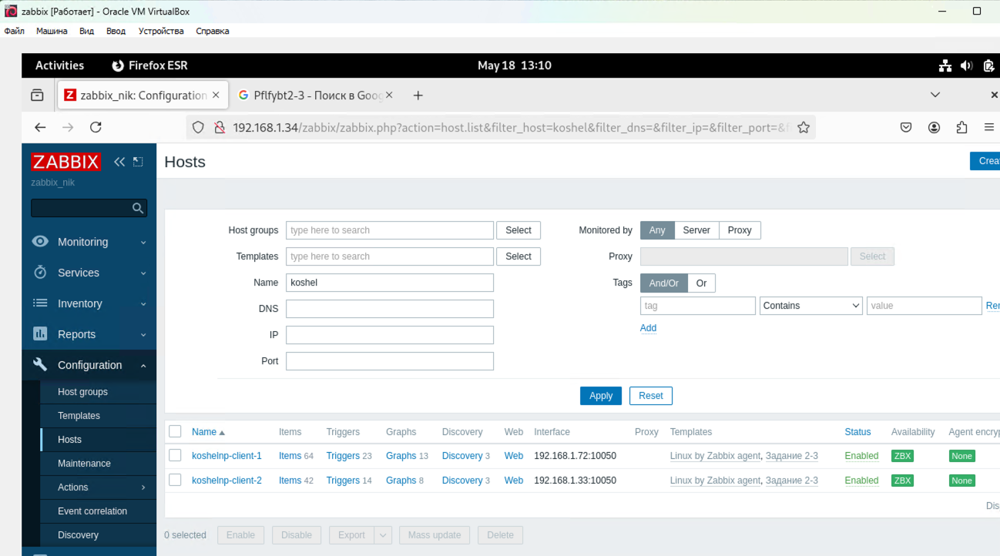
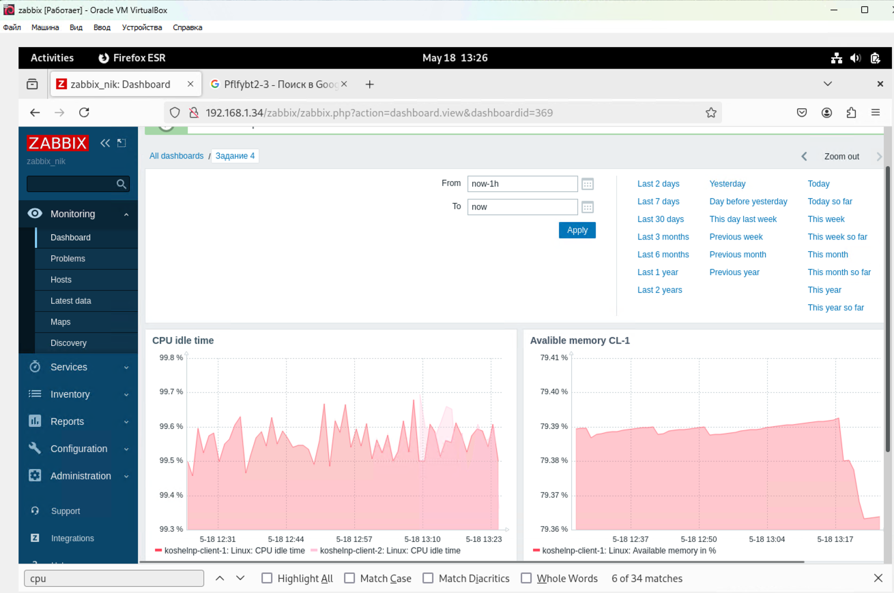
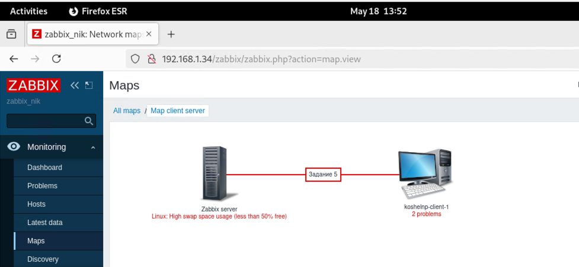

# Домашнее задание к занятию "`Система мониторинга Zabbix. Часть 2`" - `Кошель Николай Павлович`

### Задание 1

Cкриншот страницы шаблона с названием «Задание 1»

### Задание 2 and 3
Cкриншот страницы хостов, где будут видны привязки шаблонов с названиями «Задание 2-3». Хосты должны иметь зелёный статус подключения

### Задание 4
Cкриншот дашборда с названием «Задание 4»

### Задание 5* со звёздочкой
Скриншот карты, где видно, что триггер сработал, с названием «Задание 5»
